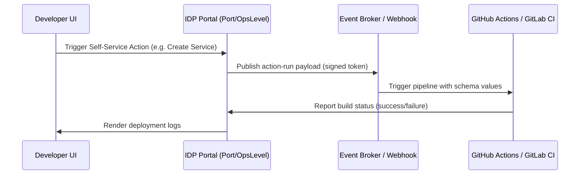

# ⚙️ Core Capabilities & Feature Comparison

---

## 📊 1. Feature Comparison Matrix

Below is a detailed comparison matrix assessing the core capabilities of the top 5 developer portals:

| Feature / Metric | Port | Cortex | Compass | OpsLevel | Configure8 |
| :--- | :--- | :--- | :--- | :--- | :--- |
| **Data Model** | Dynamic (Blueprints) | Strict (Microservices) | Semi-Dynamic | Strict (Services) | Strict + Cloud |
| **Scorecards** | Yes (Custom Queries) | Yes (Highly Advanced) | Yes (Simple Checklists) | Yes (Rubrics/Checks) | Yes (Basic Checks) |
| **Self-Service** | Yes (Actions/Runs) | Yes (Scaffolding) | No (Relies on Jira) | Yes (Self-Service) | No |
| **Cost Ingestion** | No (Requires custom) | No | Yes (Basic Cloud) | No | Yes (Deep AWS/GCP) |
| **API Type** | REST (OpenAPI) | REST / GraphQL | GraphQL | GraphQL | REST (OpenAPI) |
| **Branding / UI** | Sleek & Modern | Standard Enterprise | Jira-native Theme | Simple Functional | Sleek, Dashboard-like |

---

## 🔍 2. Technical Taxonomy Analysis

### A. Data Model Modeling: Blueprints vs. Rigid Catalogs

#### 🌀 Port: Schema-Driven Blueprints
Port provides complete flexibility. Users define **Blueprints** using JSON schemas, allowing them to catalog anything:
*   *Entities mapped:* K8s Clusters, Microservices, On-Call rotations, Cloud Accounts, and even physical offices.
*   *Relationships:* Parent-child, sibling, or multi-way mappings.

#### 🏛️ Cortex & OpsLevel: Service-First Rigidity
These portals are pre-configured around the microservice archetype.
*   Entities are defined as `Services`, `Resources`, or `Systems`.
*   Adding custom metadata requires appending key-value properties rather than redefining the core database schema. This simplifies startup but limits horizontal team use cases (e.g., modeling financial wallets or SEO campaign portfolios).

#### 🗺️ Configure8: Cloud Resource Centric
Configure8 auto-ingests cloud assets (S3 buckets, RDS databases, ECS services) and maps their linkages to code repositories automatically. It acts more like an Application Performance Management (APM) asset register.

---

## 🔌 3. Developer Self-Service Execution

An IDP is only half a tool if it only catalogs; developers want to *execute* actions.

### ⚡ Self-Service Maturity

*   **Port Actions**: Uses a robust webhook model. Triggering a "Create Repository" action fires a structured JSON payload to a webhook, Kafka, or GitHub Actions runner, keeping execution decoupled and secure.
*   **OpsLevel Self-Service**: Enables custom markdown forms that invoke webhooks or direct integrations, specifically structured for developer bootstrapping and terraform orchestration.
*   **Compass & Configure8**: Do not support direct self-service runbooks natively, relying instead on developers triggering pipelines in external tools (e.g., Jira or harness.io) and reporting metadata back.

---

> [!TIP]
> **Key Recommendation for Our Platform:**  
> If we construct a lightweight, high-performance portal, we should prioritize **Port's blueprint-driven approach** combined with **Cortex's scorecard compliance engine**. This dual-force combination yields high architectural flexibility while maintaining strict software standards.
