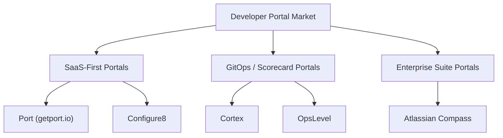

# 🌐 Market Landscape Overview: Internal Developer Portals (IDP)

> **Status:** Completed Audit (EXP-002)  
> **Target Focus:** Enterprise Developer Experience (DevEx) & Software Cataloging

---

## 📋 1. Market Definition & Context

An **Internal Developer Portal (IDP)** serves as the central interface for platform engineering, consolidating service catalogs, infrastructure orchestrations, documentation, and operational metrics into a single cohesive cockpit. 

As organization complexity grows, teams encounter **"cognitive overload"** caused by microservices sprawl, scattered documentation, and fragmented cloud environments. The IDP market has emerged to solve this directly by:
*   **Centralizing Service Discovery**: Creating a single source of truth for who owns which service, what APIs they expose, and their current health.
*   **Enforcing Engineering Standards**: Aligning developer activities with organizational guidelines via automated scorecards and check rubrics.
*   **Enabling Developer Self-Service**: Abstracting cloud infrastructure complexity through direct, guardrailed automation templates.

---

## 🗺️ 2. Mapped Competitor Landscape

Our dogfooding experiment maps the top 5 direct competitors currently defining this landscape:

### Competitor Summaries

1.  **Port (getport.io)**: A highly customizable SaaS portal that utilizes a generic, schema-driven blueprint model. Users define their own entities and relationships, providing absolute flexibility.
2.  **Cortex (cortex.io)**: A mature portal emphasizing scorecards and software maturity. Deep integrations allow engineering leads to define "standards" and automatically track compliance across repositories.
3.  **Compass (Atlassian)**: A developer experience platform deeply woven into Atlassian’s suite (Jira, Confluence). Focuses heavily on developer metrics, team ownership, and simple component scorecards.
4.  **OpsLevel (opslevel.com)**: One of the earliest dedicated service catalogs, specializing in maturity rubrics, automated check pipelines, and self-service actions.
5.  **Configure8 (configure8.io)**: A catalog-centric portal that sets itself apart by integrating environment tracking, active deployment statuses, cloud cost mapping, and security profiles under a unified UI.

---

## 🎯 3. Our Strategic Opportunity

By dogfooding Spotify's **Backstage** locally, we gain direct experience in the friction points that these SaaS competitors exploit. Backstage is powerful but has a high operational overhead:
*   **Maintenance Burden**: Upgrading Backstage versions and managing the Yarn isolation workspace is complex and time-consuming.
*   **Infrastructure Requirements**: It requires running dedicated backend services, databases (PostgreSQL/SQLite), and configuring local builders.

### The Opportunity Gap
Our startup can carve out a highly profitable niche by bridging the gap:
*   **Zero-Config Developer Cataloging**: Delivering a lightweight, static-compilable, or cloud-hosted catalog tailored for monorepos (like `cmp-monorepo`) using pnpm or Turborepo structures.
*   **Niche Integration Alignment**: Aligning directly with niche capabilities such as automated WCAG accessibility gating, stablecoin checkout verification, and AI citation visibility.

---

> [!NOTE]
> Detailed technical comparisons of these competitor APIs, blueprints, and capabilities are documented in the [Core Capabilities Audit](./core-capabilities.md). Pricing analysis and commercial packaging can be found in the [Pricing Analysis](./pricing-analysis.md).
