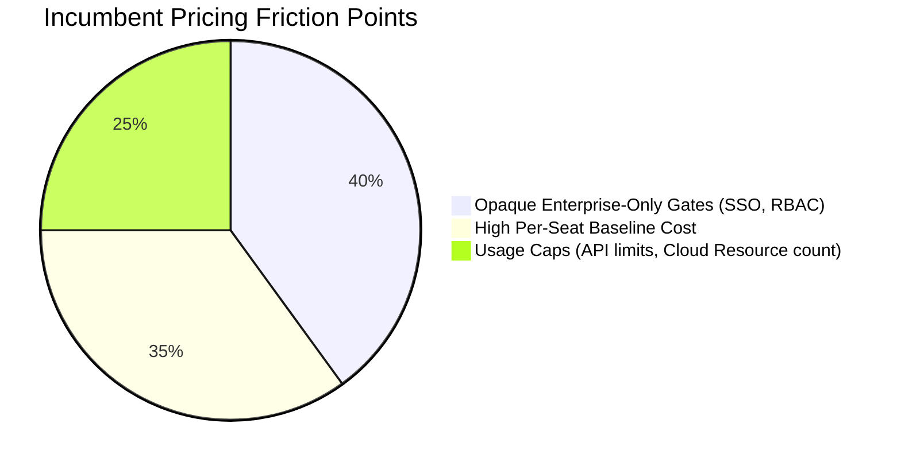

# 🪙 Pricing Analysis & Commercial Models

---

## 💵 1. Commercial Pricing Matrix

The developer portal market is primarily monetized via **Seat-Based Licensing** combined with **Usage-Based Volume Scales** (number of registered services/resources). Below is the compiled pricing architecture for our top 5 competitors:

| Competitor | Free Tier | Entry Tier | Mid/Enterprise Tier | Pricing Driver |
| :--- | :--- | :--- | :--- | :--- |
| **Port** | Yes (up to 15 users, 150 runs) | `$10 / seat / month` | Custom Enterprise | Registered seats + Action runs |
| **Cortex** | No | Custom Demo | `$30+ / developer / month` | Developer seats + Integrations |
| **Compass** | Yes (up to 20 users) | `$7 / seat / month` | Custom Enterprise | Atlassian Cloud Seat bundle |
| **OpsLevel** | No | `$8 / seat / month` | `$18+ / seat / month` (Pro/Ent) | Seats + Rubric Check Volume |
| **Configure8** | Yes (up to 3 users) | `$12 / seat / month` | Custom Enterprise | Seats + Ingested Cloud Resource Count |

---

## 📈 2. Monetization Models & Value Drivers

### 👥 Seat-Based Licensing
The core driver for most portals is the **Developer Seat count**. Because developer portals are intended for the *entire* engineering organization to discover services and write code, pricing scales directly with team size.
*   *Strategic Lock-in:* Once 100% of an engineering org is onboarded, the annual contract value (ACV) becomes highly sticky.
*   *Enterprise Leverage:* Premium features like Single Sign-On (SSO), RBAC, custom plugins, and dedicated support require upgrading to opaque, high-margin Enterprise tiers.

### ⚙️ Usage-Based Friction Points
Portals are increasingly adding usage gates to prevent high volume resource ingestion on lower tiers:
*   **Port**: Imposes monthly limits on "Action Runs" (self-service script trigger completions) and total ingestion API requests on their team tiers.
*   **Configure8**: Leverages cloud resource count thresholds. Organizations with massive AWS infrastructure (thousands of S3 buckets/ECS tasks) are forced into higher tiers regardless of seat count.

---

## 🛡️ 3. Packaging Opportunities for Our Platform

To compete effectively, we can exploit the primary licensing friction points of the incumbents:

### 💎 Recommended Disruptive Playbook
If we monetize our lightweight monorepo portal, we should introduce:
1.  **Repository-Based Flat Pricing**: Instead of charging per developer seat, charge a flat rate per repository/workspace. This eliminates seat-expansion fear among CTOs.
2.  **Open-Core Backstage Extensions**: Distribute premium, specialized plugins (e.g., WCAG Accessibility validators, stablecoin audit components) for a licensing fee while keeping the core Backstage integrations completely open-source.
3.  **Self-Hosted Static Portal**: Provide an affordable tier for entirely static, compiled HTML portals that run inside GitHub Pages/S3, eliminating the database server maintenance costs.
