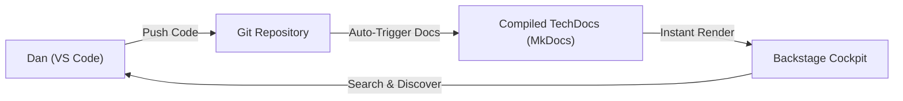

# 🧑‍💻 Primary User Persona: Dan, the Overwhelmed Developer

> *"I spend 40% of my week searching for API keys, reading outdated Wiki pages, and debug-failing my Docker builds instead of writing actual business logic."*

---

## 📊 1. Profile Summary & Demographics

| Attribute | Profile Detail |
| :--- | :--- |
| **Role** | Senior Backend Engineer / Microservice Developer |
| **Organization Size** | 150 - 500 Engineers (scaling rapidly) |
| **Specialization** | REST APIs, Event-Driven Services, Cloud Integration |
| **Typical Stack** | NestJS, TypeScript, PostgreSQL, Docker, AWS (ECS / Lambda) |
| **Aesthetic Vibe** | Dark mode everything, custom mechanical keyboard, coffee enthusiast |

---

## 💔 2. A Day in the Life & Core Friction Points

Dan works in a fast-paced environment that has transitioned from a monolith to over **80 microservices**. While this allows teams to move fast in isolation, it has created immense cognitive load:

### 🔍 A. Discovery Friction (The Search Hunt)
*   **The Problem:** When Dan needs to integrate with the new `BillingPayment` service, there is no central registry. 
*   **The Routine:** He has to search Slack history, ask in a general engineering channel, and finally dig through random GitHub repositories to find where the code lives. 
*   **Impact:** Waste of 2-3 hours of prime productive focus.

### 📚 B. Fragmented / Stale Documentation (The Confluence Abyss)
*   **The Problem:** Once he finds the repo, the `README.md` was last updated 14 months ago. The API spec listed in Confluence is out of sync with what is running in production.
*   **The Routine:** Dan runs local curl requests and shadows logs in the staging environment to guess the correct HTTP headers and request schemas.
*   **Impact:** Prone to runtime schema breaks and high frustration.

### ⚙️ C. Tooling & Platform Friction (The "DevOps Tax")
*   **The Problem:** Dan has to manage his own local Docker Compose files, Kubernetes manifests, and CI/CD pipelines. Standard platform enforcement feels like "bureaucratic red tape" rather than help.
*   **The Routine:** He spends hours debugging a failed GitHub Actions run because a secret or policy changed on the AWS cluster.
*   **Impact:** Burnout and a complete lack of flow state.

---

## 🎯 3. Dan's Key Objectives

1.  **Reduce Non-Productive Cognitive Load:** Spend less time tracking down service owners, credentials, and API shapes.
2.  **Frictionless Scaffolding:** Bootstrapping a new compliant microservice should take 5 minutes, not 3 days of copying and pasting boilerplate files.
3.  **Clean, Auto-Updating API Specifications:** Trust that the documentation matches production *without* manual doc maintenance.

---

## 🛡️ 4. How Our Product Solves Dan's Pain

Instead of forcing Dan to log into another heavy, corporate dashboard, our **Lightweight Monorepo-Focused Developer Portal** integrates directly into his code-level workflow:

*   **Code-First Integration:** All catalog metadata and documentation live *with* the code in `catalog-info.yaml` and standard Markdown files. Dan never has to open Confluence again; his documentation is compiled automatically.
*   **Instant API Discovery:** A clean, searchable portal where every microservice and its public OpenAPI specification are registered and always up to date.
*   **Zero-Config Cataloging:** A lean, blazing-fast workspace catalog tailored for Turborepo and pnpm monorepos, avoiding Spotify Backstage's massive operational maintenance tax.
