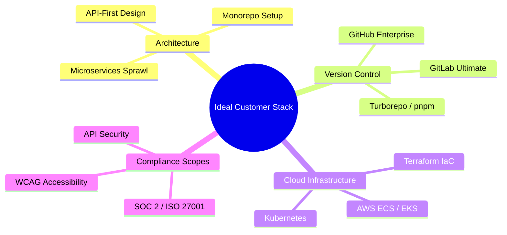

# 🎯 Ideal Customer Profile (ICP) Framework

---

## 🏢 1. Firmographic Target Sweet Spot

Our primary target market consists of scaling, technology-first organizations experiencing microservices expansion but lacking the infinite resources of Big Tech companies:

| Attribute | Target Range | Rationale |
| :--- | :--- | :--- |
| **Engineering Org Size** | 50 - 500 Developers | Large enough to suffer microservice sprawl; small enough to reject high SaaS per-seat costs. |
| **Funding / Stage** | Series A to Series C / Profitable Scaleup | Active growth requires building software standards, but budget is heavily optimized. |
| **Company Size** | 200 - 1,000 Employees | Organizational complexity is high, creating communication silos between teams. |
| **Vertical Focus** | Fintech, SaaS, E-Commerce, Developer Tooling | Highly regulated or complex architectures with strict compliance needs (SOC 2, WCAG, API security). |

---

## 💻 2. Technical Profile & Infrastructure Stack

The ideal customer has transitioned away from monoliths and is fully committed to modern, distributed architectures:

*   **Microservice Sprawl:** Managing between **30 and 150+ microservices** with active, distributed REST or GraphQL APIs.
*   **Monorepo Commitments:** High affinity for workspace tools (e.g., Turborepo, pnpm workspaces, Nx) to coordinate frontend and backend micro-packages.
*   **Infrastructure:** Run on Kubernetes (EKS/GKE), AWS ECS, or serverless setups managed via Infrastructure-as-Code (Terraform, Pulumi).
*   **CI/CD Pipeline Maturity:** Standardized on GitHub Actions, GitLab CI, or CircleCI for continuous deployment.

---

## ⚡ 3. Critical Buying Triggers & Pain Points

An organization becomes an active prospect for our lightweight portal when they experience one of these three triggers:

1.  **The "Who Owns This?" Slack Incident:** An outage occurs in production, and engineers waste 45 minutes trying to find the slack channel, pagerduty schedule, or repository owner of the failing component.
2.  **SaaS Bill Shock:** The platform team tries to adopt Cortex or Port, but is presented with a `$30,000` annual per-seat licensing proposal, causing the VP of Engineering or CFO to veto the purchase.
3.  **Audit Compliance Failure:** The security or QA team flags dozens of repositories that lack active OWNERS files, run on stale Docker parent images, or fail basic accessibility and schema standards in staging.

---

## 🛡️ 4. Our Strategic Differentiators vs. Competitors

| Dimension | Cortex / Port / OpsLevel | Our Lightweight Portal | Our Strategic Advantage |
| :--- | :--- | :--- | :--- |
| **Monetization** | Seat-Based Fee Trap (`$10` to `$30` / user / mo) | **Flat Workspace / Repository Rates** | Predictable, risk-free budget planning. CFOs enthusiastically approve flat fees. |
| **Hosting Cost** | Dynamic SaaS only, or heavy stateful backend | **Static-Compiled Option (Jamstack)** | Completely serverless. Host for free on GitHub Pages/S3 with zero DB server upkeep. |
| **Scaffolding Cost** | High API integration overhead | **Code-First Native (`catalog-info.yaml`)** | Integrates directly with Turborepo and pnpm workspaces in seconds. |
| **Compliance Focus** | Generic scorecards | **Deep, Niche-Aligned Scorecard Plugins** | Out-of-the-box checks for WCAG accessibility, stablecoin checkout rails, and AEO visibility. |
