# 👩‍💼 Primary Buyer Persona: Lisa, the Platform Lead

> *"I want to enforce engineering standards and secure microservices without blowing our entire tooling budget on per-seat licenses, and without hiring two full-time SREs just to keep Backstage from crashing."*

---

## 📊 1. Profile Summary & Demographics

| Attribute | Profile Detail |
| :--- | :--- |
| **Role** | Director of Platform Engineering / DevEx Lead |
| **Organization Size** | 200 - 1000 Engineers (scaling and structured) |
| **Responsibilities** | Developer productivity, compliance (SOC 2 / ISO), platform ROI |
| **Key Directives** | Standardize developer tooling, decrease time-to-market, reduce cost |
| **Typical Stack** | Kubernetes, Terraform, Backstage (Self-Hosted), GitHub Enterprise |

---

## 💔 2. Strategic Friction Points & Buying Hurdles

Lisa is caught between two high-friction realities. She wants to build a premier internal developer platform, but faces extreme head-winds:

### 💸 A. Per-Seat Licensing Dread (The Budget Trap)
*   **The Problem:** Commercial developer portals (Cortex, Port, Compass) charge aggressive seat-based fees (`$10` to `$30` per developer per month).
*   **The Friction:** To provide true cataloging value, she must onboard *every* developer, tester, and manager in the company. For an organization with 300 engineers, this equates to up to `$108,000` annually just for a service index, drawing severe pushback from the CFO.
*   **Impact:** Adoption stalling or limited to a subset of engineers, reducing the portal's effectiveness.

### 🛠️ B. Backstage Maintenance Nightmare (The Operations Tax)
*   **The Problem:** Lisa knows Spotify's open-source Backstage is the industry standard, but it has massive operational complexity:
    *   Upgrading packages breaks plugins and local configurations constantly.
    *   It requires dedicated database instances (PostgreSQL) and hosting infrastructure.
*   **The Friction:** She must allocate 1-2 dedicated, highly paid platform engineers just to maintain and build internal Backstage integrations.
*   **Impact:** Strategic budget is spent on "internal tooling maintenance" rather than building actual product features.

### 🛡️ C. Out-of-Sync Compliance & Standards (The Security Gap)
*   **The Problem:** Microservices are spinning up with missing owners, stale versions, and outdated security profiles.
*   **The Friction:** She has no centralized "Scorecard" dashboard that tracks compliance dynamically across all repositories in real-time.
*   **Impact:** Security vulnerability incidents and failed technical audits.

---

## 🎯 3. Lisa's Core Buying Objectives

1.  **Lower Total Cost of Ownership (TCO):** Establish a developer portal catalog with a predictable, scalable commercial model (like flat repository pricing).
2.  **Zero-Maintenance Architecture:** Implement a catalog that doesn't require constant infrastructure upkeep, such as a static-compiled portal running in S3/GitHub Pages.
3.  **Active Compliance Scorecards:** Automatically evaluate code repositories against strict standards (security, code coverage, WCAG accessibility) before deploy.

---

## 🛡️ 4. How Our Product Solves Lisa's Business Pain

Our startup directly targets Lisa's commercial and operational pain points with a **Disruptive Open-Core Playbook**:

```mermaid
graph TD
    Incumbent["Incumbent SaaS Portals"] --> SeatFee["Aggressive Seat-Based Fees ($30/dev/mo)"]
    Incumbent --> Opaque["Opaque Enterprise Gates"]
    
    OurPortal["Our Open-Core Portal"] --> FlatPrice["Flat Repository-Based Pricing"]
    OurPortal --> Static["Static-Compiled HTML Portal (Zero Hosting Cost)"]
    OurPortal --> Scorecards["Automated Compliance Scorecards Built-In"]
    
    style OurPortal fill:#1e3d30,stroke:#2e5c46,stroke-width:2px;
```

*   **Repository-Based Flat Licensing:** Lisa can onboard 1,000 developers for the exact same price as 50. CTOs and CFOs love the predictability of flat flat workspace rates.
*   **Zero-Maintenance Static Portal:** Our compiled static portal generates lightweight, high-performance HTML/JS assets. It can be hosted on GitHub Pages or Amazon S3 for literally pennies a month, requiring zero database maintenance.
*   **Built-in Specialized Scorecard Plugins:** We provide built-in, out-of-the-box scorecards tracking specialized domains (e.g., WCAG Accessibility, stablecoin checkouts, SEO visibility) so Lisa can enforce engineering standards automatically during the CI/CD pipeline run.
