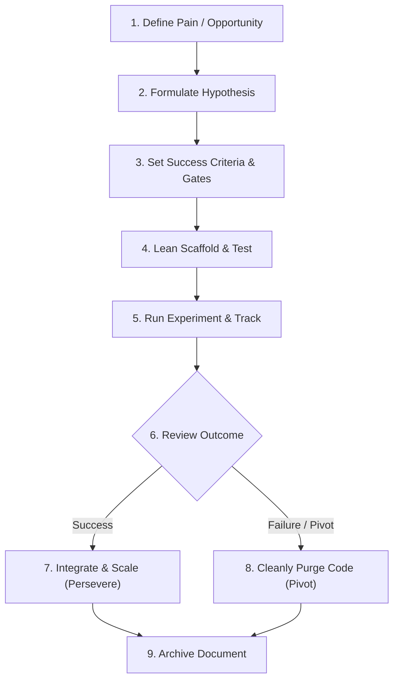

# Company of One — Experiment Protocol

All product features, technical architectures, and strategic shifts in this **Company of One** are treated as **Experiments**. 

Treating work as experiments enforces scientific rigor, keeps features lean, defines clear success criteria upfront, and ensures we only maintain code that provides verified value.

---

## 🔬 Core Principles of the Protocol

1.  **Falsifiability**: Every experiment must have a hypothesis that can be proven false. If an experiment cannot fail, it is not an experiment.
2.  **Lean Scaffolding**: Build only what is necessary to validate the hypothesis. Avoid pre-optimizing for scale before validating value.
3.  **Strict Gating**: No experiment code is merged into `main` without completing its pre-defined validation criteria.
4.  **Graceful Cleanup**: If an experiment fails to meet its success criteria, it must be easily and entirely removable. We do not accumulate dead code.

---

## 🎯 Niche Domain & Career-Focused Stack Alignment

Experiments in this repository are not random feature spikes. They must intentionally align with three critical growth vectors:

1.  **Niche Domain Knowledge**: Every experiment must investigate or solve a specific, high-value, and specialized industry domain problem (e.g., WCAG accessibility standards, stablecoin/web3 payment rails, SEO/Lighthouse audit mechanics, AI recommendation engine optimization (AEO), outbound pipeline analysis, or enterprise developer portals).
2.  **Career-Focused Stacks**: Implementations must utilize modern, in-demand technical stacks and architectural patterns that build specialized professional value (e.g., Backstage Developer Portals, Turborepo monorepo configurations, Playwright visual regression systems, advanced React/Angular state patterns, or automated n8n workflows).
3.  **Dogfooding-First**: Whenever we build a system capability or strategy, we must dogfood it ourselves first using our own platform, proving its efficacy in a live operational environment before scaling.

---

## 🔄 The Experiment Lifecycle



---

## 📝 Phase 1: Problem & Hypothesis Structure

Before writing any code, we formulate a hypothesis. The hypothesis is stated using a standard, strict structure:

> **Hypothesis Statement:**
> "We believe that **[doing action]**
> for **[target audience / system component]**
> will result in **[expected outcome / impact]**,
> and we will know this is successful when we observe **[measurable quantitative metric / signal]**."

### Validation Scale
Every hypothesis must be scored on the **Value vs. Effort Matrix**:
- **Reach**: How many users / processes will this affect?
- **Impact**: On a scale of 0.25 to 3, how much will this solve the core pain?
- **Confidence**: What percentage of certainty do we have in our estimates?
- **Effort**: What is the implementation cost in developer-days?

---

## 📈 Phase 2: Success Criteria & Gates

Each experiment must define two levels of metrics:

### 1. Primary Success Metrics (The Green Gate)
The exact numeric target that proves the hypothesis. 
- *Example*: "Increase page-load speed by 30%."
- *Example*: "Get 5 unique developer catalog registrations in Backstage."

### 2. Guardrail Metrics (The Red Gate)
The metrics that must **not** degrade during the experiment.
- *Example*: "Lighthouse Accessibility score must not drop below 95."
- *Example*: "API error rate must remain below 0.05%."

---

## 💻 Phase 3: Scaffolding and Implementation

To keep the repository clean and maintainable under [monorepo-conventions.md](file:///Users/stefan/Code/monorepo/docs/monorepo-conventions.md), use these structural rules:

1.  **Branch Naming**: All experiment branches follow:
    `sheldoncrosss/exp-[number]-[short-description]`
2.  **Isolated Directories**:
    - If the experiment is a new service: scaffold under `apps/exp-[name]/`.
    - If it's a library/utility: scaffold under `packages/exp-[name]/`.
    - If it's an enhancement to an existing service: guard the logic behind a **feature flag** or a cleanly marked config parameter.
3.  **Local Testing**: Every experiment must provide local test coverage (using `pnpm test` or specific Playwright configurations).

---

## 🧪 Phase 4: Validation & Testing

We default to automated validation. For any user-facing experiment, the validation workflow must include:

-   **Unit & Integration Tests**: Implemented locally within the workspace package.
-   **Playwright Visual Regression**: Screen capture script for verifying the UI layout across mobile and desktop.
    ```bash
    ./qa-playwright-capture.sh http://localhost:8000 public/qa-screenshots
    ```
-   **TechDocs Registration**: The experiment log must be added to the Backstage navigation menu to ensure documentation visibility.

---

## ⚖️ Phase 5: The Review & Decision

At the end of the experiment window, we make a binary choice:

### Option A: Persevere (Integrate & Scale)
If success criteria are fully met:
- Refactor the code from its temporary scaffold into the permanent packages/apps.
- Remove any feature flags or temporary routing.
- Promote the documentation from `active` to `archived`.

### Option B: Pivot (Cleanly Purge)
If success criteria are **not** met:
- **Delete the experimental directories** (`apps/exp-[name]` or `packages/exp-[name]`).
- Revert any feature-flag integrations.
- Keep only the experiment report under `docs/experiments/archive/` as a record of what we learned.

---

## 📁 Repository Directory Structure

All experiment files are stored under `docs/experiments/`:

```
docs/experiments/
├── README.md               # Overview of active/past experiments
├── protocol.md             # This document (rules & framework)
├── templates/
│   └── proposal-template.md # Template for starting an experiment
├── active/
│   └── exp-001-example.md  # Log of an ongoing experiment
└── archive/
    └── exp-000-sample.md   # Record of completed experiments
```
